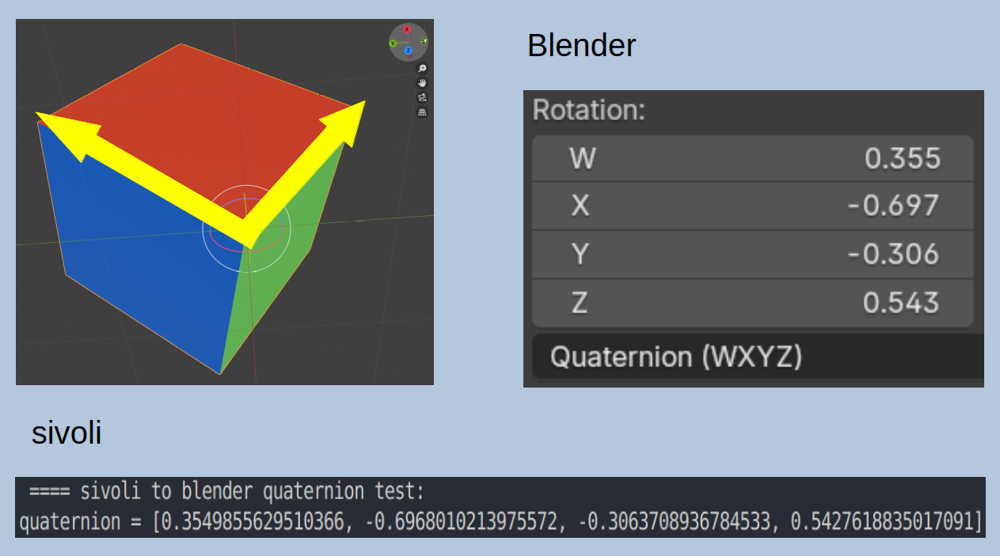

# sivoli

0. *SI*mple *V*ector *O*perations for (pure) python *LI*sts.

1. Just a veteran's day weekend project.

2. 3D 

3. Numpy, scipy... can it be done without them.

4. Mostly for positioning stuff in space.

5. Work in progress, snail speed, use at your own risk.

