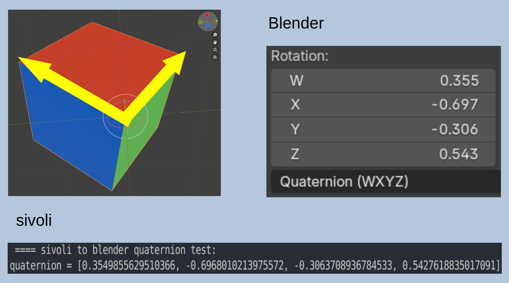

# sivoli

**SI**mple **V**ector **O**perations for (pure) python **LI**sts.

- Just a veteran's day weekend project.

- 3D 

- Numpy, scipy... can it be done without them.

- Mostly for positioning stuff in space.

- Work in progress, snail speed, use at your own risk.

